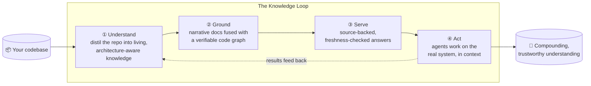

# KnowledgeLoop

**The knowledge layer that makes AI agents trustworthy on real codebases.**

The solid path runs today; the dotted feedback edge — agents writing their results back — is the roadmap.

---

## The problem

AI coding agents are dazzling on a blank page and dangerously unreliable on a large,
living codebase. Point one at hundreds of thousands of lines and it starts to guess —
inventing APIs that don't exist, misreading how the pieces fit together, changing the
wrong layer. Not because the model is weak, but because it has no durable, trustworthy
picture of the system it's working in. Every session starts from scratch, and every
answer is a confident *maybe*.

## The idea

**KnowledgeLoop is that missing picture.** It distils a codebase into living knowledge —
a clear map of how the system actually works, anchored to the real code beneath it — and
serves it to agents through a single interface where every answer is backed by real
source and labeled with how current it is. When its knowledge is out of date, it says so
instead of quietly making something up. Stale information fails loudly rather than lying —
exactly the property you need before you let an agent *act*.

## Why it's a *loop*

Knowledge shouldn't be a static document that rots the moment code changes. KnowledgeLoop
is built to **close the loop**: agents read what the system knows, act on it, and feed
their results back in — so understanding compounds with every task instead of decaying.
The codebase stops being a wall the agent bumps into and becomes an asset that gets
smarter the more it's used.

## Real today

The foundation already works: KnowledgeLoop reads production codebases across eight
languages, builds their knowledge, and answers grounded, source-backed questions about
them through a single interface. The next step — agents that write their learnings back —
turns that foundation into a flywheel.

## Modules & development stage

KnowledgeLoop ships as four stages. Three run end-to-end today; the fourth — the part that
makes it a *loop* — is the roadmap.

| Stage | Module / capability | What it does | Stage |
|---|---|---|---|
| **Produce** | CodeWiki engine | Parses a repo (8 languages) and generates an architecture-aware Markdown + Mermaid wiki | ✅ Built |
| **Bridge** | Wiki↔Graph entity map | Joins the narrative docs to a verifiable code graph, so every claim resolves to real code | ✅ Built |
| **Consume** | `repo_memory` MCP facade | One interface, 12 tools — overview, search, call-tracing, grounded explanations, impact analysis | ✅ Built |
| **Consume** | Freshness & fail-closed grounding | Tags every answer fresh / stale and refuses to answer rather than guess when the graph is out of date | ✅ Built |
| **Feed back** | Execution-results loop | Agents write outcomes back into the knowledge base, so it compounds with use | 🟡 Roadmap |

*Validated end-to-end against real open-source codebases — grounded answers at `fresh`
provenance, with the read-only source untouched.*

---

> Software's hardest bottleneck is no longer writing code; it's *understanding* it.
> KnowledgeLoop turns that understanding into something durable, trustworthy, and
> self-improving — **the connective tissue between your codebase and the agents you want
> working in it.**
>
> *Knowledge that produces work, and work that improves the knowledge.*
