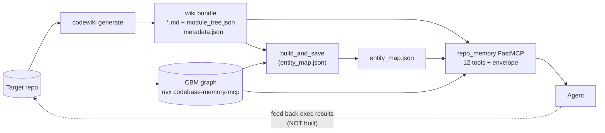

# knowledgeLoop MVP — the `repo_memory` grounded-MCP facade

## 1. What it is

**Ask the codebase.** `repo_memory` is a single MCP server that lets an agent query a
repository's architecture and code with grounded, freshness-aware answers — fusing
**CodeWiki** narrative docs (the *what/why*) with the **Codebase-Memory-MCP (CBM)** code
graph (the verifiable *where*).

This is the **consume half** of knowledgeLoop's "close the loop" vision, working
end-to-end: **produce** (CodeWiki) → **bridge** (`entity_map.json`) → **consume**
(`repo_memory` facade). The **feed-back half** — agents writing execution results back
into the knowledge base — is **NOT built** (see §6). For the narrative of all three
stages see [`docs/close-loop-workflow.md`](close-loop-workflow.md); this spec is the
dev/operator view of the working MVP.

---

## 2. Architecture at a glance

Produce → bridge → consume. CodeWiki emits a wiki bundle; an offline build joins those
modules to real graph nodes; the facade serves both behind one envelope.



**Module map** (repo-relative paths):

| Stage | Component | Role | File | Status |
|---|---|---|---|---|
| Produce | CodeWiki generate CLI | `codewiki generate` entry | `codewiki/cli/commands/generate.py` | Built |
| Produce | Doc-gen orchestrator | per-module agent loop, metadata, filename canonicalization | `codewiki/src/be/documentation_generator.py` | Built |
| Produce | Module clustering | components → module tree | `codewiki/src/be/cluster_modules.py` | Built |
| Bridge | `build_and_save` | offline Wiki↔Graph join → `entity_map.json` | `repo_memory/entity_map_build.py` | Built |
| Bridge | Match grading / data model | exact→suffix→file→unmatched; `EntityMap`, save/load | `repo_memory/bridge/builder.py`, `repo_memory/bridge/schema.py` | Built |
| Bridge | Verify-on-access | re-check entries against live graph | `repo_memory/bridge/verify.py` | Built |
| Consume | FastMCP facade | `build_app`, `TOOL_NAMES`, `main()` | `repo_memory/server.py` | Built |
| Consume | Response envelope | uniform contract | `repo_memory/contract.py` | Built |
| Consume | Freshness gates | `compute_freshness` / `require_fresh` / `graph_is_current` | `repo_memory/grounding.py` | Built |
| Consume | Wiki / bridge / graph / hybrid tools | the 12 tool impls | `repo_memory/tools/*.py` | Built |
| Consume | CBM stdio client + forwards | long-lived subprocess, tool-name forwards | `repo_memory/graph/client.py`, `repo_memory/graph/forward.py` | Built |
| Consume | CBM project resolver | resolve+cache CBM `project` id | `repo_memory/graph/project.py` | Built |
| Consume | Deploy launch-spec | profiles → CBM spawn command/env/cwd | `repo_memory/deploy.py` | Built |
| Consume | Bounded refresh | re-index graph + rebuild map | `repo_memory/refresh.py` | Built |
| Feed-back | execution-results loop | write outcomes back into the KB | — | **Aspirational (not built)** |

---

## 3. Stand it up

All three steps run against one target repo. Full deploy reference:
[`docs/repo_memory-deploy.md`](repo_memory-deploy.md).

**(a) Generate the wiki** (run from the target repo):
```bash
codewiki generate --output ./wiki-docs --github-pages --verbose
```
Produces `./wiki-docs/*.md`, `module_tree.json`, `first_module_tree.json`, `metadata.json`
(+ `index.html`). `metadata.generation_info.commit_id` is the freshness anchor (§4).

**(b) Build the entity_map bridge.** Offline join via `build_and_save` in
`repo_memory/entity_map_build.py` — it walks `wiki.module_tree`, unions referenced files,
`enumerate_nodes_for_files(...)` against CBM, then `build_entity_map(...)` and writes
`entity_map.json` with `graph_commit = repo_head`. It takes the resolved CBM `project` and
is also re-invoked at runtime by `refresh_index`.

**(c) Launch the `repo_memory` MCP server** (stdio). `main()` reads four env vars, then
`resolve_launch_spec(os.environ)` computes how CBM is spawned:

| Env var (read in `server.py main()`) | Default | Purpose |
|---|---|---|
| `REPO_MEMORY_WIKI_DIR` | `wiki-docs` | CodeWiki bundle dir |
| `REPO_MEMORY_ENTITY_MAP` | `entity_map.json` | bridge artifact path |
| `REPO_MEMORY_REPO_PATH` | `os.getcwd()` | repo root (used by `refresh_index`) |
| `REPO_MEMORY_CBM_PROJECT` | unset | optional CBM project override; else auto-resolved from CBM |

CBM is spawned as one long-lived stdio subprocess. The deploy profile and CBM knobs
(consumed by `deploy.resolve_launch_spec`):

| Env var | Effect |
|---|---|
| `REPO_MEMORY_CBM_PROFILE` | `dev` (default) / `ephemeral` / `shared` / `ci`; the latter three **require a cache dir** |
| `REPO_MEMORY_CBM_VERSION` | pin CBM version; else `profile.version` → `DEFAULT_CBM_VERSION` = **`0.8.1`** |
| `REPO_MEMORY_CBM_COMMAND` | full override of the spawn command (whitespace-split) |
| `REPO_MEMORY_CBM_CWD` | CBM subprocess cwd |
| `CBM_CACHE_DIR`, `CBM_WORKERS` (1–256 or dropped), `CBM_LOG_LEVEL`, `CBM_DIAGNOSTICS`, `CBM_SEMANTIC_ENABLED`, `CBM_SEMANTIC_THRESHOLD`, `CBM_LSP_DISABLED`, `CBM_SQLITE_MMAP_SIZE` | raw `CBM_*` knobs (precedence: profile env → environ knobs → explicit `cache_dir`) |

Default spawn command: `uvx codebase-memory-mcp@0.8.1`. Because the MCP SDK merges child
env over a **clean** environment, `deploy.PRESERVE_ENV` re-injects `HOME, XDG_CONFIG_HOME,
APPDATA, LOCALAPPDATA, PATH, TMP, TEMP, USERPROFILE`. If CBM fails to spawn, the lifespan
sets `state.cbm = None` and wiki tools keep working (§4 graceful degradation).

---

## 4. Capabilities

### The 12 tools (`TOOL_NAMES`, registration order)

| Capability | Tool | Params | Purpose |
|---|---|---|---|
| Wiki | `get_repo_overview` | — | High-level repo overview from the wiki (use FIRST) |
| Wiki | `list_modules` | — | List wiki module names / boundaries |
| Wiki | `search_wiki` | `query` | Keyword search over module docs (how-X / which-module-Y) |
| Wiki | `get_module_doc` | `module` | One module's doc + path + components |
| Bridge | `get_related_files` | `module` | Map a wiki module → real files+symbols (graph-verified) |
| Graph | `search_code_graph` | `name_pattern=None, label=None, file_pattern=None, limit=200` | Structural symbol search |
| Graph | `trace_symbol` | `function_name, direction="both", depth=3` | Caller/callee call-path trace |
| Graph | `get_code_snippet` | `qualified_name` | Source for a symbol by qualified name |
| Graph | `get_architecture` | — | Graph-level summary (languages, entry points, hotspots) |
| Hybrid | `explain_with_sources` | `query` | How/why answer with graph-verified evidence (read-only; never blocks — see §4) |
| Hybrid | `assess_impact` | `base_branch=None` | Fail-closed blast-radius of current changes (the only gating tool) |
| Recovery | `refresh_index` | — | Re-index graph + rebuild Wiki↔Graph map (NOT wiki regen) |

> Impl note: the underlying `graph_tools.search_code_graph` / `forward.search_graph` also accept
> an `offset=0` param, but the registered `search_code_graph` tool exposes only `limit=200`.

### Uniform response envelope (`repo_memory/contract.py`)

Every tool returns `envelope(...)`:

| Field | Meaning |
|---|---|
| `result` | tool payload (or `null` when degraded/blocked) |
| `freshness` | one of `FRESHNESS = ("fresh", "stale-wiki", "stale-graph", "unverified")` |
| `provenance` | `{repo_head, wiki_commit, graph_commit}` (each defaults `None`) |
| `confidence` | float or `null` |
| `warnings` | list (e.g. degradation messages) |
| `unmatched` | list of unresolved components/symbols |

### Guarantees

- **Freshness reporting (Tier A — every tool).** `compute_freshness(state)` attaches a
  freshness enum, **precedence graph > wiki**: `unverified` (no CBM, or `repo_head` /
  `entity_map.graph_commit` unknown) → `stale-graph` (`graph_commit != HEAD` or an entry
  failed verify-on-access) → `stale-wiki` (only docs behind HEAD) → `fresh` (all aligned).
  A stale wiki **never blocks** a read.
- **Fail-closed (Tier B).** `require_fresh(state)` returns a blocking freshness string
  unless `graph_is_current(state)` — True **only if** `cbm is not None` **and** `repo_head`
  is set **and** `entity_map.graph_commit == repo_head`. Among the 12 exposed tools,
  **only `assess_impact` is fail-closed** — it always gates on `require_fresh` (and further
  checks `ensure_project`, `detect_changes`, and per-symbol verifiability, returning a blocked
  envelope if any impacted symbol is not verifiable). The `explain_with_sources` *function*
  can gate (`require_verification=True`), but the **registered MCP tool never does**:
  `server.py` calls `hybrid_tools.explain_with_sources(state, query)` without that flag, so it
  defaults to `False` and the live tool is **always read-only and never blocks**. The gate is
  reachable only via the internal function or tests.
- **Graceful degradation.** CBM spawn failure → `state.cbm = None`; wiki-only tools still
  answer. Missing wiki/entity_map degrade those `AppState` fields to `None`; `CBMUnavailable`
  surfaces as `warnings`, not exceptions.
- **Repo not indexed → run `refresh_index`.** Graph/hybrid tools need the repo indexed in
  CBM so the `project` resolves; if not, they degrade with the warning
  `repo not indexed in CBM (run refresh_index)`. `refresh_index` re-indexes at HEAD and
  rebuilds `entity_map.json` with `graph_commit = repo_head`, which is what makes
  `graph_is_current` pass again. It **does not** regenerate wiki docs.

---

## 5. What's proven

- **202 offline tests pass.** Run:
  ```bash
  .venv/bin/python -m pytest tests/ -p no:cacheprovider -m "not integration" --no-cov -s
  ```
  Note: pass **`-s`** — without disabling capture this suite tears down with
  `ValueError: I/O operation on closed file.` (a capture-finalizer crash, not a test
  failure). `--no-cov` is needed only if `pytest-cov` is absent (pyproject sets `--cov`).
  Count: `collected 206 / 4 deselected / 202 selected`, exit code 0 (verify with
  `grep -c PASSED`). With `-s`, pytest's `===== 202 passed =====` summary line is suppressed,
  so the run ends on the last `PASSED` line — the pass count is real even though the summary
  banner is absent.
- **Validated end-to-end against real CBM 0.8.1** — `search_code_graph`,
  `get_architecture`, `trace_symbol`, `get_code_snippet` return real results once the
  `project` is threaded through every forward call.
- **Lint clean.** `.venv/bin/ruff check repo_memory/` → "All checks passed!".
  (`mypy repo_memory/` still surfaces residual notes under the permissive config — 27 errors
  total, 22 of them `no-any-return` from MCP-SDK forwards, the rest implicit-Optional defaults;
  the engine `codewiki/` package is the mypy-checked surface per CLAUDE.md.)
- **Consolidated on `master`.**
- **Gated integration tests** carry `@pytest.mark.integration` (marker declared in
  `pyproject.toml`: *"needs network (uvx) and a real CBM run"*), in
  `tests/test_rm_integration.py` and `tests/test_rm_deploy.py`. Run explicitly:
  ```bash
  .venv/bin/python -m pytest tests/test_rm_integration.py -m integration
  ```

---

## 6. Not in the MVP (non-goals)

- **The feed-back loop is unbuilt.** No execution-results path. `repo_memory/graph/forward.py`
  forwards only CBM's **read** surface (`list_projects`, `search_graph`, `trace_path`,
  `get_code_snippet`, `get_architecture`, `get_graph_schema`, `index_status`,
  `index_repository`, `detect_changes`) — none of CBM's write/trace/ADR-style tools are wired
  in, and there is no agents/skills layer that consumes-then-feeds-back. The dashed arrow in
  §2 is aspirational.
- **No LLM wiki regeneration on refresh.** `refresh_index` re-indexes the **graph** only and
  rebuilds the entity_map; it never touches `wiki_commit` or regenerates `*.md`, so a stale
  wiki stays `stale-wiki` after a refresh.
- **No server-side routing classifier / reranker / agent-utility eval.** Tool routing is
  left to the calling LLM via tool descriptions; `repo_memory/routing_eval.py` is only a
  deterministic offline guard that the descriptions still carry their routing cues — not a
  runtime classifier or reranker.
- **The knowledgeLoop ↔ CBM repo merge is not done.** CBM remains an unmodified, pinned
  upstream dependency spawned via `uvx`; per-deployment settings are injected through
  `deploy.resolve_launch_spec`, not by forking CBM.

---

## 7. Pointers

- [`docs/SETUP.md`](SETUP.md) — from-zero install/run quickstart (prerequisites, launch command, MCP-client config, troubleshooting).
- [`docs/close-loop-workflow.md`](close-loop-workflow.md) — produce/bridge/consume/feed-back narrative + stage map.
- [`docs/repo_memory-deploy.md`](repo_memory-deploy.md) — deploy-profile operator guide (profiles, knobs, recipes, version pin).
- [`CLAUDE.md`](../CLAUDE.md) — high-signal repo essentials; marks the consume-and-feed-back loop as future direction.
- [`DEVELOPMENT.md`](../DEVELOPMENT.md) — full CodeWiki engine architecture map.
