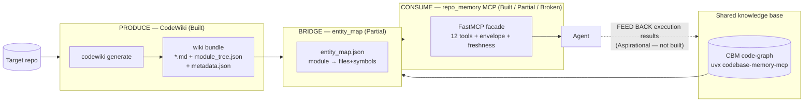

# Close-Loop Workflow

> **Status (2026-06-14):** the produce + consume halves exist; the feed-back half is aspirational, and
> the graph tools are currently **broken against the published CBM** (see Known Gaps). Mark every
> stage/tool against its real status — do not assume the loop closes end-to-end yet.

knowledgeLoop's "close the loop" system is built in three conceptual halves, two of which exist today
and one that is aspirational. **CodeWiki PRODUCES** architecture knowledge — it parses a repo with
tree-sitter, clusters it into a module tree, runs a per-module agent loop, and emits a
Markdown/Mermaid/HTML wiki plus `module_tree.json` / `metadata.json` structure artifacts. A
**Wiki↔Graph BRIDGE** (`entity_map.json`) joins those wiki modules to real files+symbols in the
Codebase-Memory-MCP (CBM) code graph. **repo_memory CONSUMES** both as a single grounded,
freshness-aware MCP facade (12 tools) over the generated wiki + the CBM graph. The fourth arrow —
agents **FEEDING execution results BACK** into the knowledge base — is explicitly *not yet built*
(CLAUDE.md: "Future direction").



All paths below are repo-relative (root: this repository). The sibling CBM checkout is
`../codebase-memory-mcp`.

---

## Stages

### Stage 1 — PRODUCE: CodeWiki generation pipeline — **Built**
Parses a repo and emits the architecture-knowledge bundle.

| Concern | Component |
|---|---|
| CLI entry (`codewiki generate`, `--update` incremental) | `codewiki/cli/commands/generate.py` |
| CLI→engine adapter, multi-stage async pipeline | `codewiki/cli/adapters/doc_generator.py` |
| Runtime config + artifact filename constants | `codewiki/src/config.py` |
| Dependency graph (tree-sitter) | `codewiki/src/be/dependency_analyzer/dependency_graphs_builder.py` |
| Module clustering | `codewiki/src/be/cluster_modules.py` |
| Per-module agent loop + metadata + filename canonicalization | `codewiki/src/be/documentation_generator.py` |
| Per-module agent (API path) | `codewiki/src/be/pydantic_ai_backend.py` |
| HTML viewer (only with `--github-pages`) | `codewiki/cli/html_generator.py` |

**Output contract** (lands in the `--output` dir, default `./docs`): per-module `<Module>.md` (Mermaid
fenced inline), `overview.md`, `module_tree.json` (the live tree — canonical ground truth) +
`first_module_tree.json` (cached clustering), `metadata.json`, and optionally `index.html`. The raw
dependency graph is written under a temp dependency-graphs dir in the output.

`metadata.json` carries `generation_info{timestamp, main_model, generator_version "1.0.1", repo_path,
commit_id}` (built in `documentation_generator.py` ~L231-236), plus `statistics` and `files_generated`.
**`generation_info.commit_id` is the inter-run hook**: `--update` diffs it against HEAD to invalidate
only affected `<node>.md`. (The dogfooded CBM wiki at `../codebase-memory-mcp/codewiki-docs` has
`commit_id: null` — relevant to freshness below.)

### Stage 2 — BRIDGE: Wiki↔Graph entity_map — **Partial**
Joins wiki `module_tree` components (`file::Symbol`) to CBM `NodeRecord`s, grading each match.

| Concern | Component |
|---|---|
| Offline build / `build_and_save` (top-level path) | `repo_memory/entity_map_build.py` |
| Join + match grading | `repo_memory/bridge/builder.py` |
| Data model (`EntityMap`, `CONFIDENCE`, save/load) | `repo_memory/bridge/schema.py` |
| Verify-on-access | `repo_memory/bridge/verify.py` |
| Path reconcile (CodeWiki paths ↔ CBM `file_path`) | `repo_memory/bridge/paths.py` |
| CBM row→node adapter + `CBMGraphProbe` | `repo_memory/graph/nodes.py` |

Match strategies + confidence: `exact=1.0` → `qualified_suffix=0.85` → `file_only=0.5` →
`unmatched=0.0`. **Partial because the build enumerates the graph via `forward.search_graph`, which is
broken against real CBM** (see Gaps) — so a clean build only works against a mocked/compatible graph,
though the join *logic* itself is sound and tested offline.

### Stage 3 — CONSUME: repo_memory MCP facade — **Built (wiki) / Partial (bridge) / Broken (graph)**
One FastMCP server (`repo_memory`) exposing 12 tools, each returning the uniform envelope.

| Concern | Component |
|---|---|
| FastMCP entry, `build_app`, `TOOL_NAMES`, `main()` | `repo_memory/server.py` |
| Response envelope | `repo_memory/contract.py` |
| Shared `AppState` / `load_app_state` | `repo_memory/state.py` |
| Wiki loader / search / wiki tools | `repo_memory/wiki/loader.py`, `.../wiki/search.py`, `.../tools/wiki_tools.py` |
| Bridge tool (`get_related_files`) | `repo_memory/tools/bridge_tools.py` |
| Forwarded graph tools | `repo_memory/tools/graph_tools.py` |
| Hybrid fusion tools | `repo_memory/tools/hybrid_tools.py` |
| CBM stdio client (one long-lived subprocess) | `repo_memory/graph/client.py` |
| CBM tool-name/arg forwards (drift-containment point) | `repo_memory/graph/forward.py` |
| Deploy launch-spec resolver | `repo_memory/deploy.py` |
| Freshness gates | `repo_memory/grounding.py` |
| Bounded refresh | `repo_memory/refresh.py` |

Degraded mode is pervasive: CBM spawn failure → `state.cbm=None`; missing wiki/entity_map → those
`AppState` fields degrade to `None`; `CBMUnavailable` → warnings, not exceptions. Wiki-only operation
always stays alive.

### Stage 4 — FEED BACK: execution-results loop — **Aspirational (not built)**
No feedback/trace/loop module exists in repo_memory. CBM exposes an `ingest_traces` tool, but
repo_memory never forwards it, and no agents/skills layer that consumes-then-feeds-back exists.
CLAUDE.md labels this "Future direction (not yet built)."

---

## Running it today

### (a) Generate the wiki
```bash
# Run from the target repo. Provider/model come from ~/.codewiki/config.json + keyring.
# CODEWIKI_NO_KEYRING=1 forces file-based creds in headless environments.
codewiki generate --output ./docs --github-pages --verbose
codewiki generate --update        # incremental: diffs HEAD vs metadata commit_id
codewiki generate --concurrency 4 # opt-in parallel module processing (default 1)
```
Produces `./docs/*.md`, `module_tree.json`, `first_module_tree.json`, `metadata.json` (+ `index.html`).

### (b) Build the entity_map bridge
The offline join is `build_and_save` in `repo_memory/entity_map_build.py` (walks `wiki.module_tree`,
unions component files, `enumerate_nodes_for_files` → `build_entity_map`, sets `graph_commit=repo_head`,
writes `entity_map.json`). It is also invoked by `refresh_index` at runtime. **Note:** it enumerates the
graph through the broken `forward.search_graph`, so a clean build against live CBM 0.8.1 currently fails
(see Gaps).

### (c) Launch the repo_memory MCP facade
`main()` reads exactly three env vars, then `resolve_launch_spec(os.environ)` computes how CBM is
spawned, and runs over **stdio**:

| Env var | Default | Purpose |
|---|---|---|
| `REPO_MEMORY_WIKI_DIR` | `docs` | where the CodeWiki bundle lives |
| `REPO_MEMORY_ENTITY_MAP` | `entity_map.json` | bridge artifact path |
| `REPO_MEMORY_REPO_PATH` | `os.getcwd()` | repo root (used by `refresh_index`) |

CBM spawn knobs (consumed by `deploy.resolve_launch_spec` — full reference in
`docs/repo_memory-deploy.md`):

| Env var | Effect |
|---|---|
| `REPO_MEMORY_CBM_PROFILE` | `dev` / `ephemeral` / `shared` / `ci` (default `dev`; the latter three **require a cache dir**) |
| `REPO_MEMORY_CBM_COMMAND` | full override of the spawn command (split on whitespace) |
| `REPO_MEMORY_CBM_VERSION` | pin CBM version (else profile.version → `DEFAULT_CBM_VERSION` = `0.8.1`) |
| `REPO_MEMORY_CBM_CWD` | CBM subprocess cwd |
| `CBM_CACHE_DIR`, `CBM_WORKERS` (1..256 or dropped), `CBM_LOG_LEVEL`, `CBM_DIAGNOSTICS`, `CBM_SEMANTIC_ENABLED`, `CBM_SEMANTIC_THRESHOLD`, `CBM_LSP_DISABLED`, `CBM_SQLITE_MMAP_SIZE` | raw `CBM_*` knobs (precedence: profile env → environ knobs → explicit `cache_dir`) |

CBM is spawned as a single long-lived stdio subprocess: `resolve_launch_spec` →
`LaunchSpec(command, env, cwd)` → `CBMClient` → `StdioServerParameters`. Default command:
`uvx codebase-memory-mcp@0.8.1`. Because the MCP SDK merges child env over a **clean** environment (not
the parent's), `deploy.PRESERVE_ENV` re-injects `HOME, PATH, XDG_CONFIG_HOME, APPDATA, LOCALAPPDATA,
TMP, TEMP, USERPROFILE`.

### (d) The 12 tools an agent calls
`TOOL_NAMES` in `repo_memory/server.py`, in registration order:

| Tool | Purpose | Backing — status |
|---|---|---|
| `get_repo_overview` | High-level repo overview from the wiki (use FIRST) | Wiki — Built |
| `list_modules` | List wiki module names / boundaries | Wiki — Built |
| `search_wiki` | Keyword (substring) search over module docs | Wiki — Built |
| `get_module_doc` | One module's doc + path + components | Wiki — Built |
| `get_related_files` | Map a wiki module → real files+symbols (graph-verified); also returns `unmatched` | Bridge — Partial |
| `search_code_graph` | Structural symbol search (name/label/file, `limit=200`) | Graph — Broken vs real CBM |
| `trace_symbol` | Caller/callee call-path trace (`direction="both"`, `depth=3`) | Graph — Broken |
| `get_code_snippet` | Source for a symbol by `qualified_name` | Graph — Broken |
| `get_architecture` | Graph-level architecture summary | Graph — Broken |
| `explain_with_sources` | How/why answer (wiki narrative + graph-verified evidence) | Hybrid — Partial (graph half dead) |
| `assess_impact` | Fail-closed blast-radius; blocks if graph not current | Hybrid — Broken vs real CBM |
| `refresh_index` | Re-index graph + rebuild Wiki↔Graph map (NOT wiki regen) | Recovery — Broken vs real CBM |

---

## Response contract envelope

Every tool returns `contract.envelope(...)`:

| Field | Meaning |
|---|---|
| `result` | tool payload (or `null` when degraded/blocked) |
| `freshness` | one of `FRESHNESS = ("fresh", "stale-wiki", "stale-graph", "unverified")` |
| `provenance` | `{repo_head, wiki_commit, graph_commit}` (all default `None`) |
| `confidence` | float or `null` (e.g. avg entity-entry confidence for `get_related_files`) |
| `warnings` | list (e.g. `["CBM error: ..."]` on degradation) |
| `unmatched` | list of unresolved components/symbols |

Freshness values (`grounding.compute_freshness`, precedence **graph > wiki**):
- `unverified` — can't tell: no CBM, or `repo_head` / `entity_map.graph_commit` unknown.
- `stale-graph` — `graph_commit != HEAD`, **or** an entry failed verify-on-access.
- `stale-wiki` — only the wiki docs are behind HEAD (`wiki_commit != HEAD`; the wiki_commit source is
  the loaded wiki, falling back to the entity_map's recorded `wiki_commit`).
- `fresh` — all aligned.

---

## Freshness & refresh

**Two-tier policy** (`repo_memory/grounding.py`):
- **Tier A (reporting)** — read-only tools just attach `compute_freshness` for reporting; a stale wiki
  never blocks.
- **Tier B (blocking, graph-only)** — `require_fresh(state)` returns a blocking freshness string unless
  `graph_is_current(state)`, which is True **only if** `cbm is not None` **and** `repo_head` is set
  **and** `entity_map.graph_commit == repo_head`. `assess_impact` (and `explain_with_sources` when
  verification is required) gate on this.

**Recovery — `refresh_index` → `refresh(state)`** (`repo_memory/refresh.py`): degrades gracefully if
`cbm`/`wiki` are missing, else calls `forward.index_repository(path=state.repo_path or ".")`, then
`build_and_save(...)` rebuilds + saves the entity_map with `graph_commit = repo_head` (which is what
makes `graph_is_current` pass again). It **does not** touch `wiki_commit` or regenerate wiki docs, so a
stale wiki stays `stale-wiki` after a refresh.

> On the dogfooded artifact, freshness is stuck at `unverified` because
> `metadata.generation_info.commit_id` is `null` (no `repo_head` match possible).

---

## Known gaps — NOT yet closed

### 1. CBM 0.8.1 graph-API mismatch — BREAKS all forwarded graph tools
`repo_memory/graph/forward.py` does not match CBM 0.8.1's required argument schema. Verified two ways
this session: **live introspection** of the running CBM (`ClientSession.list_tools()`) and a **runtime
error** from the deploy-config integration test.

- **Missing required `project`:** `search_graph`, `trace_path`, `get_code_snippet`, `get_architecture`,
  and `detect_changes` all omit `project`. CBM 0.8.1's live schema marks `project` as **required** for
  each of these (e.g. `search_graph.required = ['project']`, `trace_path.required =
  ['function_name','project']`), with no implicit-project fallback. Only `index_status` passes
  `project`.
- **Wrong key for indexing:** `index_repository` sends `{"path": path}`, but CBM 0.8.1 requires
  `repo_path` (`index_repository.required = ['repo_path']`). The live call returns the error
  `repo_path is required`.

CBM returns `isError` → `CBMClient.parse_tool_result` raises `CBMUnavailable` → the graph tools wrap it
as `warnings=["CBM error: ..."]` with a `null` result. **Net effect against real CBM:**
`search_code_graph`, `trace_symbol`, `get_code_snippet`, `get_architecture`, `explain_with_sources`
(graph half), `assess_impact` (`detect_changes`), `refresh_index` (`index_repository`), and the
entity_map (re)build (enumeration via `search_graph`) all fail end-to-end and degrade to empty
envelopes.

`AppState` (`repo_memory/state.py`) has **no `project` field** — there is no plumbing to carry a CBM
project id, so the fix requires threading a project identifier through every forward call plus the
`index_repository` key change.

**The bug is masked by tests:** `tests/test_rm_graph_forward.py` asserts the project-less args as
*correct* against an `AsyncMock` CBM (green = bug locked in); the only live test
(`tests/test_rm_deploy.py`, `test_injected_cache_dir_is_used`) calls `index_repository` *directly* with
the correct `{"repo_path": ...}` key (bypassing the buggy wrapper) and self-skips when CBM is absent.
This is recorded in the agent memory note `repo-memory-cbm-graph-api-mismatch`; it warrants its own
brainstorm → spec → plan and is merge-critical for any loop-closure.

### 2. `get_related_files` serves unverified entries when CBM is down — **Partial**
It works from a prebuilt `entity_map.json`, but verify-on-access needs the live graph; with CBM
unavailable it returns entries it cannot re-verify (flagged via freshness/warnings).

### 3. The feed-back half is unbuilt — **Aspirational**
No execution-results path exists. CBM has an `ingest_traces` tool; repo_memory never forwards it, and
there is no agents/skills layer that consumes-then-feeds-back. The dashed arrow in the loop diagram is
entirely aspirational.

---

## Pointers to deeper docs
- `CLAUDE.md` — high-signal essentials; marks the consume-and-feed-back loop as future direction.
- `DEVELOPMENT.md` — full architecture map (CodeWiki engine).
- `docs/repo_memory-deploy.md` — deploy-profile operator guide.
- `docs/superpowers/specs/2026-06-14-codewiki-cbm-integration-design.md` — the CodeWiki↔CBM integration design.
- `docs/superpowers/specs/2026-06-14-repo-memory-cbm-deploy-config-design.md` — deploy-config design.
